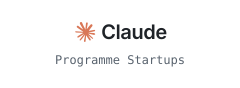
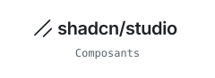

<picture><source media="(prefers-color-scheme: dark)" srcset="https://shieldcn.dev/views/user/TeeBo8.svg?base=404&variant=outline&font=geist"/></picture>

Développeur full-stack à Bordeaux, freelance sous le nom de TeeboStudio.

Portfolio : [teebostudio.fr](https://teebostudio.fr)

## Projets

### Produits

- **[BeeDirectory](https://bee-directory.com)** — Annuaire de newsletters pour trouver où sponsoriser. Clients payants.
- **[ConformeFR](https://conformefr.com)** — Générateur gratuit de mentions légales : la loi reste du code testé, le modèle de langage ne fait qu’expliquer ([code](https://github.com/TeeBo8/conforme)).

### Clients

- **[Les Clefs du Crédit](https://www.lesclefsducredit.fr)** — Site d’un courtier en prêt immobilier : simulateur, blog, référencement local.
- **[Cabinet Delcros](https://cabinetdelcros.com)** — Site d’un courtier bordelais, avec cinq simulateurs de prêt testés.

### Code ouvert

- **[NeuroBlend](https://github.com/TeeBo8/NeuroBlend-Marketplace)** — Place de marché multi-vendeurs : trois rôles, paiements répartis par Stripe Connect ([démo](https://neuroblend-demo.teebostudio.fr)).
- **[NoPayNoDate](https://github.com/TeeBo8/nopaynodate)** — Dépôt bloqué puis versé ou remboursé par Stripe Connect, chat en temps réel ([démo](https://nopaynodate.teebostudio.fr)).
- **[teebostudio-video](https://github.com/TeeBo8/teebostudio-video)** — Vidéo motion écrite en React : une composition, trois formats, rendue par GitHub Actions.

[teebostudio.fr](https://teebostudio.fr) est construit avec :

<table>
  <tr>
    <td><a href="https://vercel.com"><picture><source media="(prefers-color-scheme: dark)" srcset="assets/logos/vercel-dark.svg"/></picture></a></td>
    <td><a href="https://claude.com"><picture><source media="(prefers-color-scheme: dark)" srcset="assets/logos/claude-dark.svg"/></picture></a></td>
  </tr>
  <tr>
    <td><a href="https://shadcnstudio.com"><picture><source media="(prefers-color-scheme: dark)" srcset="assets/logos/shadcnstudio-dark.svg"/></picture></a></td>
    <td><a href="https://chanhdai.com"><picture><source media="(prefers-color-scheme: dark)" srcset="assets/logos/chanhdai-dark.svg"/></picture></a></td>
  </tr>
</table>
